# MKContentAI

"mkcontentai" is a powerful TYPO3 extension that leverages the latest advancements in artificial intelligence to generate high-quality images for your website. By connecting to both the OpenAI API and stablediffusionapi.com API, this extension provides an intuitive image generation tool that allows you to easily create custom images by simply providing a prompt.

After generating an image, user can choose which image should be saved to a directory within the TYPO3 file system. These images can then be accessed and managed through the standard TYPO3 Filelist module. Simply navigate to the directory where the images are saved, and you can preview, edit, and use them as you would with any other image in TYPO3. This makes it easy to incorporate the generated images into your website or web application, without the need for any additional steps or plugins.

## Installation

1. Install the "mkcontentai" extension in the standard TYPO3 way.
2. Once the extension is installed, it will be accessible in the left menu in the TYPO3 backend.
3. Click on the "MKContentAI" option in the left menu to access the extension's features and start generating images.

## Functionalities

### Image generation
Generate high-quality images for your website using AI. This extension provides an image generation tool that allows you to create custom images by providing a prompt. With its intuitive interface, you can easily generate images that match your desired style or content by providing a text prompt.

#### Promt Input

#### Save generated Images
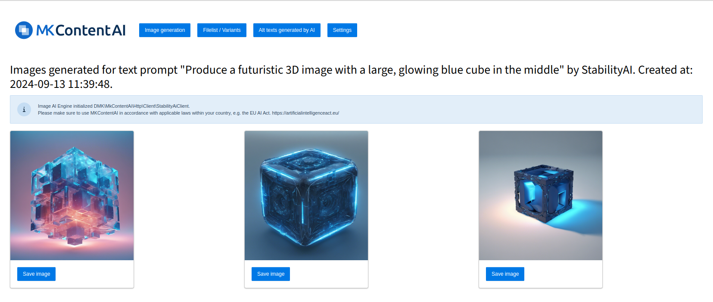

### Variants
Generate image variants of previously generated images. This feature is useful if you want to create multiple variations of an image without having to generate a new image from scratch each time.

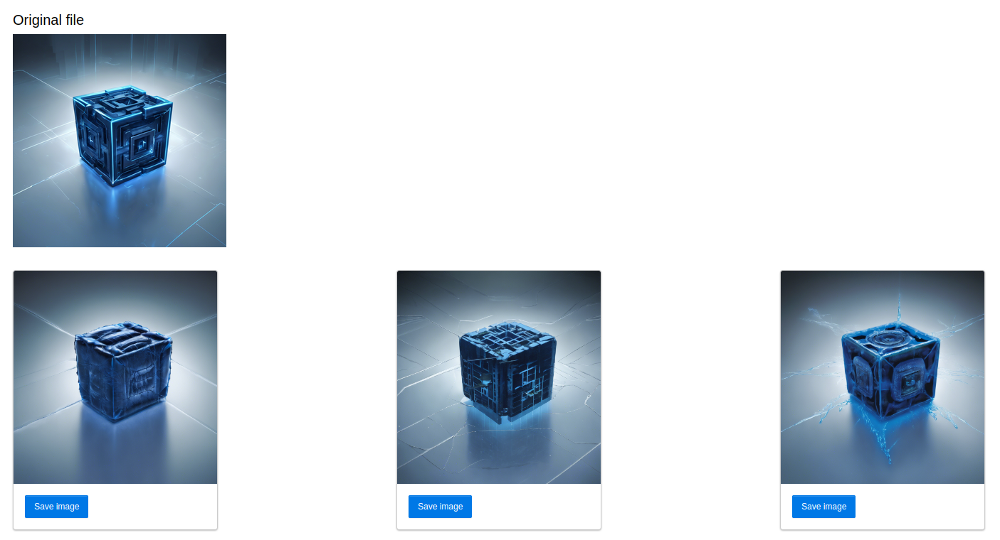

### Upscale
Generate higher-resolution images from previously generated images. Currently, it works only with OpenAI API and 256x256 or 512x512 images.

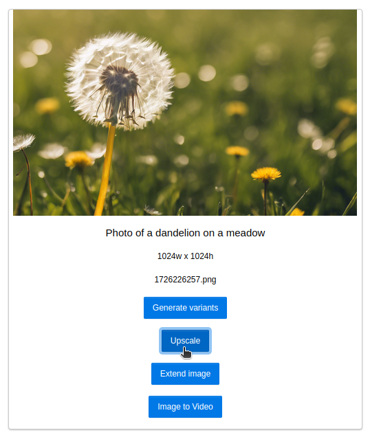

### Outpainting
Extending image with AI. Currently, it works only with StabilityAI - it is possible to extend left, right, top, bottom part of the image as well as zoom out.

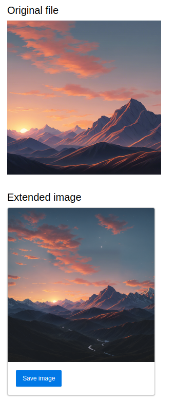

### Alt text generation
Automatic generation of alternative text (alt text) for images by alttext.ai API. This functionality is designed to enhance web accessibility and SEO performance by providing descriptive alt text for images. This functionality is implemented in two places:

- Filelist module (context menu for a given image)
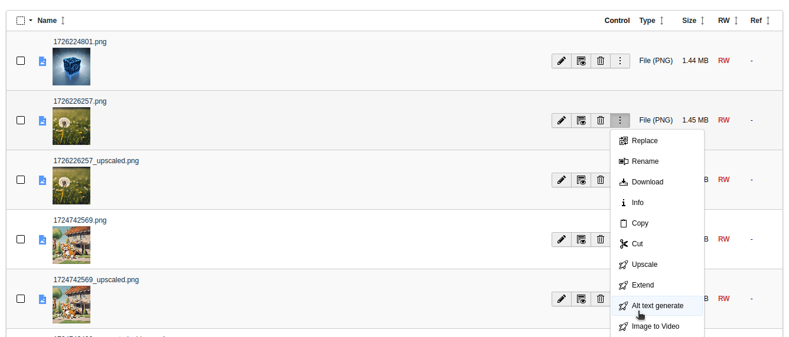
- Content element (button next to the alt text field for a given image)
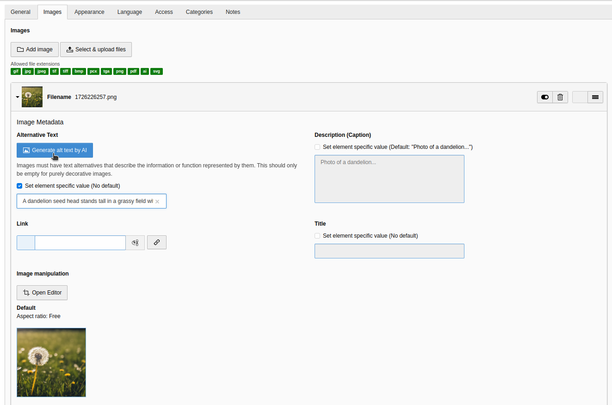

### Batch Command for Alt Text
A batch command feature enables processing all images in a given folder either by a context menu in the filelist module or by a scheduler task. This functionality helps in bulk generation of alt texts for images, improving efficiency.

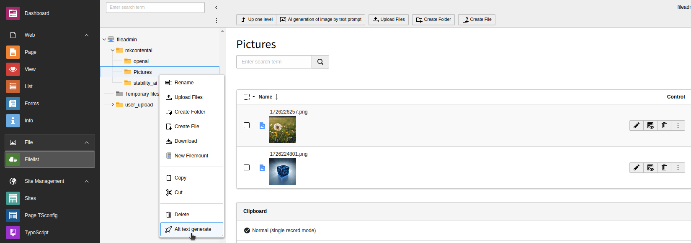

### Image to video generation
Image to video currently works only with StabilityAI. This functionality introduces the ability to create a video from provided image.

#### Format Selection:
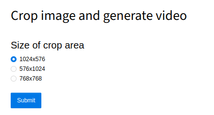

#### Result Screen:
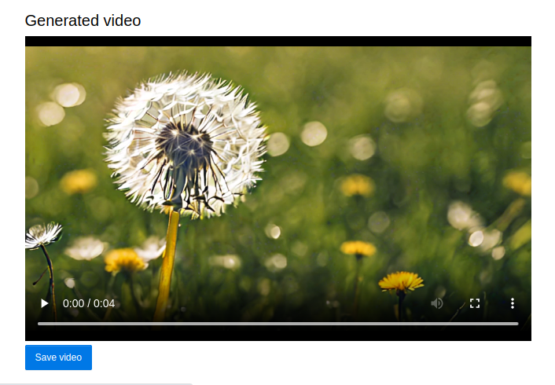

### SUMM AI API integration
SUMM AI is a tool designed to improve accessibility by transforming complex texts into both Leichte Sprache (Easy Language) and Plain Language. These formats are tailored to make content more accessible, ensuring that it can be easily understood by a broader audience, including individuals with cognitive disabilities or those who may struggle with reading comprehension.
The SUMM AI API is now implemented and ready to transform content using tt_content texts within the MKContentAI extension.

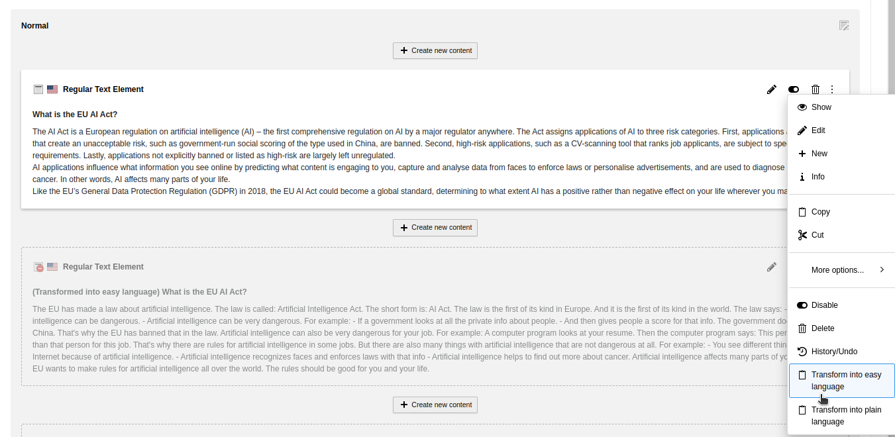

### Settings
The "Settings" section allows you to configure the AI platforms and APIs that the extension should use, as well as additional options for Stable Diffusion. Specifically, in the "Settings" section, you can:

- Choose which AI platform the extension should use: OpenAI or Stable Diffusion.
- Enter the API keys for both platforms that the extension should use to connect to the APIs.
- Choose the Stable Diffusion model that the extension should use to generate images.
- Adjust any other settings or parameters that the extension provides.
- Access Control (ACL) for settings tab to restrict access based on user roles or permissions is possible via configuring usergroup record.
- Access Control (ACL) for "AI generation of image by text prompt" button in tt_content: media field to restrict access based on user roles or permissions is possible via configuring usergroup record.

These settings can be adjusted according to your preferences and needs. It's important to ensure that the API keys are entered correctly to enable the extension to connect to the AI platforms and generate images successfully.

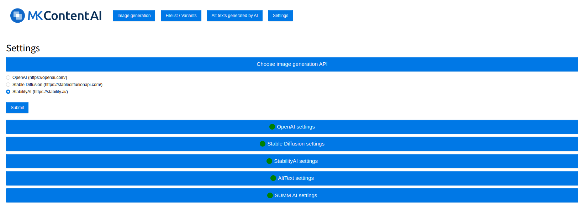

## Changelog

- 13.0.6: Fix sorting of copied tt_content elements
- 13.0.5: Fix storage of long alt texts, update documentation, update coding style
- 13.0.4: Fix JS error in BE module
- 13.0.3: Fix phpstan findings
- 13.0.2: Correct bugfix which prevented deletion of pages
- 13.0.1: Bugfix which prevented deletion of pages
- 13.0.0: Compatibility with TYPO3 v13, improved GUI, added alt-texts logs and security layer in the European Union, improved messages related with generate image operations
- 12.1.2: Crop and extend image with prompt field in StabilityAI, image to video in StabilityAI, ACL for tt_content: media field
- 12.1.1: Batch generation of alt texts, ACL for settings tab, Small bugfixes - alt-text generation failed for big images, adjust actions available via context menu on filelist, multiple images generation in tt_content
- 12.1.0: Added automatic alt text generation functionality (alttext.ai API), refactor of translations (English/German) - move to xlf files
- 12.0.6: Use dall-e-3 model from OpenAI, use stable-diffusion-xl-1024-v1-0 from StabilityAI, fix for TCA buttons
- 12.0.5: Image generation from filelist, outpainting and upscaling as context menu in filelist
- 12.0.2: Add StabilityAI including upscaling, add outpainting, little cleanup, and fixes for some warnings
- 12.0.1: Update extension icon
- 12.0.0: Initial release
